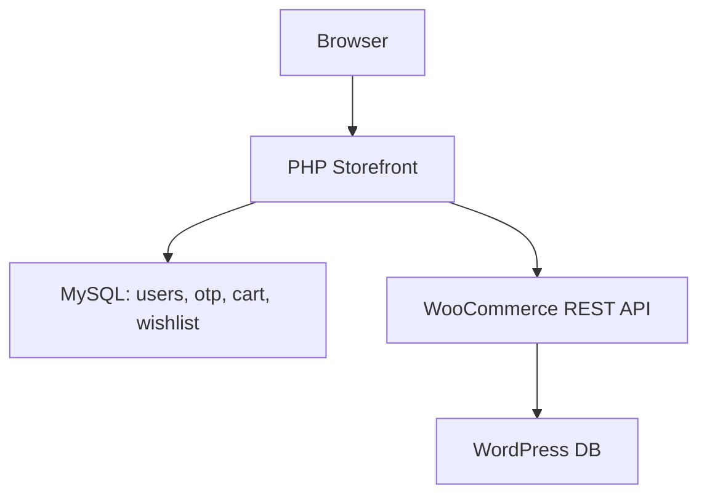

# Abdolwahab Accessories & Parfums

[](https://www.php.net/)
[](https://wordpress.org/)
[](https://woocommerce.com/)
[](#license)

Modern PHP storefront connected to a WooCommerce catalog, with a security-first
user system, cart/wishlist, and transactional email flows. The storefront uses a
dedicated MySQL schema for users, OTP, cart, wishlist, and security logs, while
products live in WordPress + WooCommerce.

## Highlights
- Fast catalog browsing with server-side caching and AJAX filtering.
- Secure auth: OTP email verification, password reset, device fingerprinting.
- Abuse protection: rate limits, IP blocks, country blocks, CSRF everywhere.
- Clean separation: WooCommerce for products, custom DB for storefront data.
- Tailwind-based UI with RTL-ready templates.

## Table of Contents
- [Quick Start](#quick-start)
- [Configuration](#configuration)
- [Architecture](#architecture)
- [Project Layout](#project-layout)
- [Key Pages](#key-pages)
- [API Endpoints](#api-endpoints)
- [Security](#security)
- [Operations](#operations)
- [Troubleshooting](#troubleshooting)
- [License](#license)

## Quick Start

### 1) Install dependencies
```bash
cd wordpress
composer install
```

### 2) Configure environment files
Create the files below in `wordpress/`:

`apikeys.env`
```env
consumer_key=ck_your_woocommerce_key
secret_key=cs_your_woocommerce_secret
wordpress_url=http://localhost:8001
```

`keys.env`
```env
SMTP_DBHOST=localhost
SMTP_DBNAME=stores
SMTP_DBUSERNAME=root
SMTP_DBPASSWORD=your_db_password
SMTP_USERNAME=your_smtp_user
SMTP_PASSWORD=your_smtp_password
SMTP_HOST=smtp.gmail.com
SMTP_PORT=465
CLOUDFLARE_TURNSTILE_SITE_KEY=your_turnstile_site_key
CLOUDFLARE_TURNSTILE_SECRET_KEY=your_turnstile_secret_key
```

### 3) Import the storefront database
```bash
cd wordpress
php import_db.php
```

### 4) Run locally
```bash
# Storefront
php -S localhost:8000 -t wordpress

# WordPress + WooCommerce
php -S localhost:8001 -t wordpress/wordpress
```
Update `wordpress_url` in `apikeys.env` to match the WordPress port.

## Configuration

### Environment Files
| File | Purpose |
| --- | --- |
| `wordpress/apikeys.env` | WooCommerce REST API credentials + base URL |
| `wordpress/keys.env` | SMTP credentials, DB creds, and Turnstile keys |

Notes:
- Do not commit `apikeys.env` or `keys.env`.
- WordPress DB credentials are in `wordpress/wordpress/wp-config.php`.

### Database
- Storefront schema: `wordpress/stores.sql`
- WordPress DB: configured in `wordpress/wordpress/wp-config.php`

## Architecture


## Project Layout
| Path | Description |
| --- | --- |
| `wordpress/` | Storefront PHP pages and API endpoints |
| `wordpress/wordpress/` | WordPress core installation |
| `wordpress/vendor/` | Composer dependencies |
| `wordpress/public/` | Images and static assets |
| `wordpress/cache/` | JSON caches |
| `wordpress/logs/` | Auth, security, and app logs |
| `wordpress/geoip/` | GeoLite2 databases |

## Key Pages
| Page | Role |
| --- | --- |
| `wordpress/index.php` | Homepage and product listing |
| `wordpress/filter.php` | Category filtering and search |
| `wordpress/product.php` | Product details |
| `wordpress/register.php` | Signup and login (AJAX + Turnstile) |
| `wordpress/otp-page.php` | OTP verification |
| `wordpress/forgot_password.php` | Password reset request |
| `wordpress/reset_password.php` | Password reset confirmation |
| `wordpress/contact.php` | Contact form |
| `wordpress/subscribe.html` | Newsletter subscribe page |

## API Endpoints
| Endpoint | Method | Purpose | Auth |
| --- | --- | --- | --- |
| `wordpress/cart-api.php` | POST | Add/update/remove/fetch cart | Optional |
| `wordpress/wishlist-api.php` | POST | Toggle wishlist items | Required |
| `wordpress/get-cart-html.php` | GET | Cart HTML snippet | Optional |
| `wordpress/get-wishlist-items.php` | GET | Wishlist HTML snippet | Required |
| `wordpress/wishlist-to-cart-bulk.php` | POST | Move wishlist to cart | Required |
| `wordpress/filter_ajax.php` | GET | AJAX product filtering | Optional |

## Security
- CSRF tokens validated across forms and API endpoints.
- Rate limits for signup, login, OTP, and subscribe flows.
- IP blocking with country restrictions (GeoIP).
- Device fingerprint checks for OTP verification.
- Logs for auth, security, and rate limiting via Monolog.

Config locations:
- Rate limits and country blocks: `wordpress/config.php`
- Security headers: `wordpress/headers-policy.php`
- GeoIP database files: `wordpress/geoip/`

## Operations
- Cache: JSON files under `wordpress/cache/` (safe to delete).
- Logs: `wordpress/logs/` (rotating logs per channel).
- Database import: `php wordpress/import_db.php`.

## Troubleshooting
- 500 errors: confirm `vendor/autoload.php` exists and env files are present.
- WooCommerce API failures: verify REST keys and `wordpress_url`.
- Email issues: confirm SMTP settings and port in `keys.env`.

## License
License not specified in this repository.
